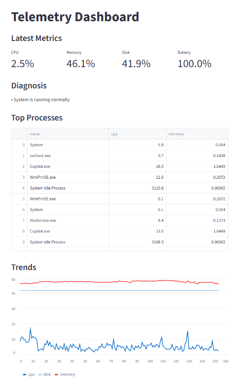

# AI Telemetry Agent 🚀

An AI-powered laptop telemetry monitoring system that collects system metrics, detects anomalies, identifies root causes, and provides confidence-based diagnostics in real time.

## 🔥 Features

- Real-time CPU, Memory, Disk, Battery monitoring
- Historical trend visualization
- AI-style diagnosis engine
- Confidence scoring for system health
- Root cause detection (top processes)
- Auto-refreshing dashboard

## 🧱 Architecture

Collector → SQLite DB → Streamlit Dashboard

## 📊 Dashboard Preview

- Live metrics
- Trends over time
- Diagnosis & explanations
- Top resource-consuming processes
## 📸 Screenshots


## ⚙️ Setup Instructions

### 1. Clone the repository
```bash
git clone https://github.com/Maverick-Manoj/ai-telemetry-agent.git

### 2. Create virtual environment
```bash
cd ai-telemetry-agent
py -m venv .venv
.venv\Scripts\activate

### 3. Create virtual environment
```bash
pip install psutil pandas streamlit scikit-learn requests matplotlib streamlit-autorefresh

### 4. Run telemetry collector
```bash
python app\collector.py

### 5. Run telemetry collector
```bash
streamlit run dashboard\dashboard.py
